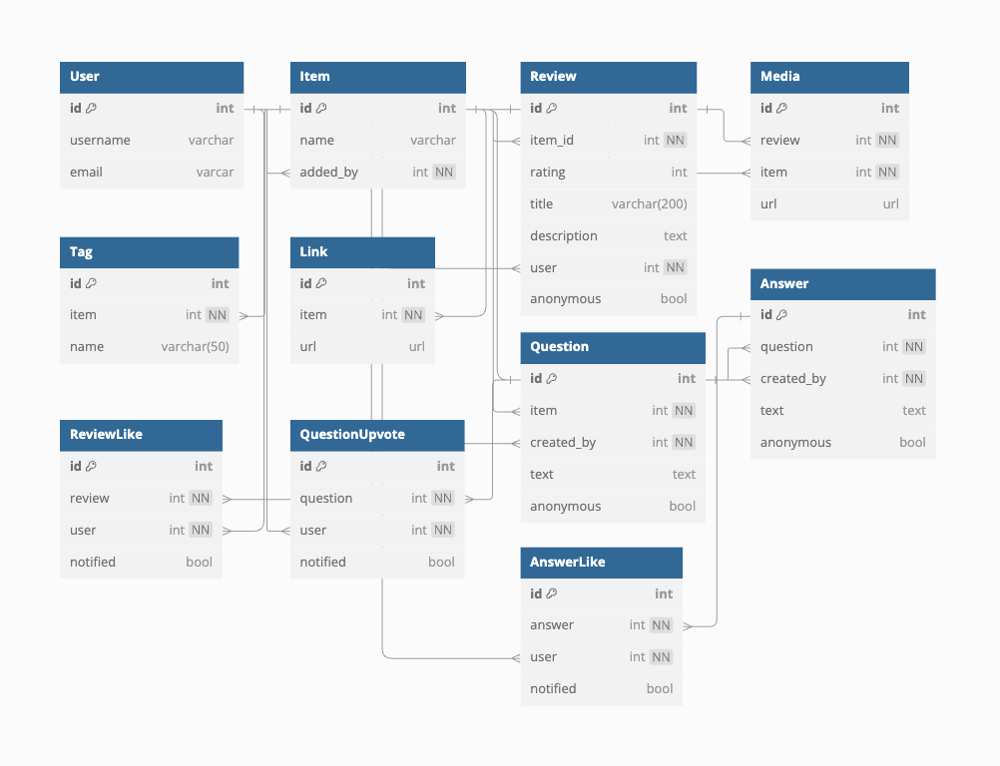

# Review Me

Review Me is website where you can add review about anything you wan't to contribute by your opinion about, whatever its a product, place, service or any other thing. You can also add reviews in fully anonymous way without showing your Identity. The website is made to help people search about products, places, services, ... taking in consideration previous people experiences in a fully freedom oriented platform.

## Technologies and Implementation

### **[Backend](#Backend)**

I **designed and Implemented over 30 RESTful APIs** with different roles and authorization. The backend is implemented using **Python** with **Django** and the database stored using containerized **Postgres** with **Docker**.

### **[Frontend](#Frontend)**

The frontend is designed and implemented using **React** applying React best practices using **States**, **Props**, **React Router**, **Hooks**, ... that communicate to the backend using RESTful APIs.

## Backend

### ORM and Database

The Database schema is set to have <strong>11 Tables</strong> to insure the system features and here there are.

### API and Backend Endpoints

The backend is designed to produce **20** RESTful API endpoints with handling different scenarios of success and failure.

| **Method** | **Endpoint**  | **Sucess**            | **Failure**     | **Level** | param                |
| ---------- | ------------- | --------------------- | --------------- | --------- | -------------------- |
| `GET`      | `/items`      | `200 OK` `page<Item>` | `404 NOT FOUND` | Guest     | `page` `size` `sort` |
| `GET`      | `/items/{id}` | `200 OK` `Item`       | `404 NOT FOUND` | Guest     | -                    |
